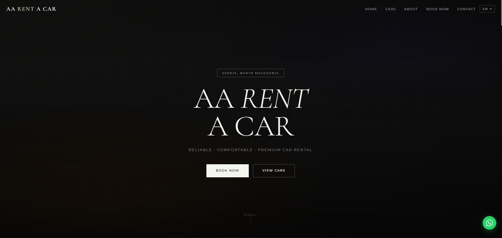

# AA Rent A Car

The website for AA Rent A Car, a car rental company in Skopje, North Macedonia.

**Live site:** [aarentacar.github.io/AA-RENT-CAR](https://aarentacar.github.io/AA-RENT-CAR/)
**Status:** Live and in use

## What it does

Customers, including travellers who need an airport pickup, can see the cars and book without making a phone call. The booking form turns their details into a ready-to-send WhatsApp message, so every request lands straight on the business's phone.

## What I built

- A language switcher for English, Albanian, Macedonian (Cyrillic) and Turkish
- A booking form (name, phone, pickup and return dates, car) that opens WhatsApp with the message already written
- Fleet, reviews, FAQ, gallery and a map to the location
- A mobile-first layout with a floating WhatsApp button

## Built with

HTML, CSS and JavaScript. Hosted on GitHub Pages.

## Run it on your computer

Download this repository and open `index.html` in any browser.

---

Built by [Fisnik Zenuli](https://github.com/fisnikzenuli)
